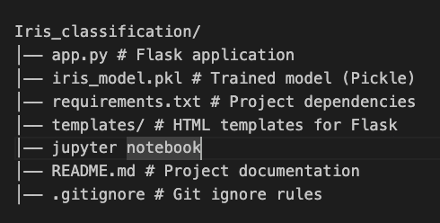
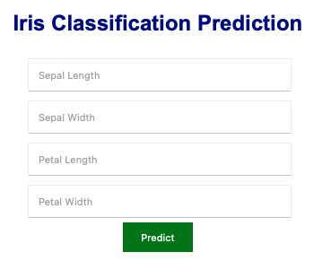

# 🌸 Iris Classification using Machine Learning

A complete **Machine Learning project** that classifies Iris flowers into three species — **Setosa**, **Versicolor**, and **Virginica** — using multiple algorithms.  
The project includes **data exploration**, **model training**, and a **Flask web application** for deployment.

---

## 🚀 Features
- Clean **EDA (Exploratory Data Analysis)** with visualizations  
- Trained with **Logistic Regression, Decision Tree, and Random Forest**  
- Model saved in **Pickle format** for reuse  
- **Flask-based web app** for real-time predictions  
- Deployable on **AWS EC2** or any cloud platform  

---

## 📂 Project Structure


---

## 🛠️ Installation & Usage

### 1️⃣ Clone the Repository
```bash
git clone https://github.com/Puneet1223/Iris_classification.git
cd Iris_classification
2️⃣ Create Virtual Environment
python3 -m venv venv
source venv/bin/activate   # On Mac/Linux
3️⃣ Install Requirements
pip install -r requirements.txt
4️⃣ Run Locally
python3 app.py
Then open your browser at:
http://127.0.0.1:8080
📊 Models Used
Logistic Regression
Decision Tree
Random Forest
The best-performing model was chosen and saved as iris_model.pkl.
🌐 Deployment
Easily deployable on AWS EC2, Heroku, or Docker.
Example:
nohup python3 app.py &
will run the app in the background on a server.
```
📸 Demo Screenshot
 

## Author
Puneet Kumar
GitHub: Puneet1223
Email: puneetrajpoot513@gmail.com
